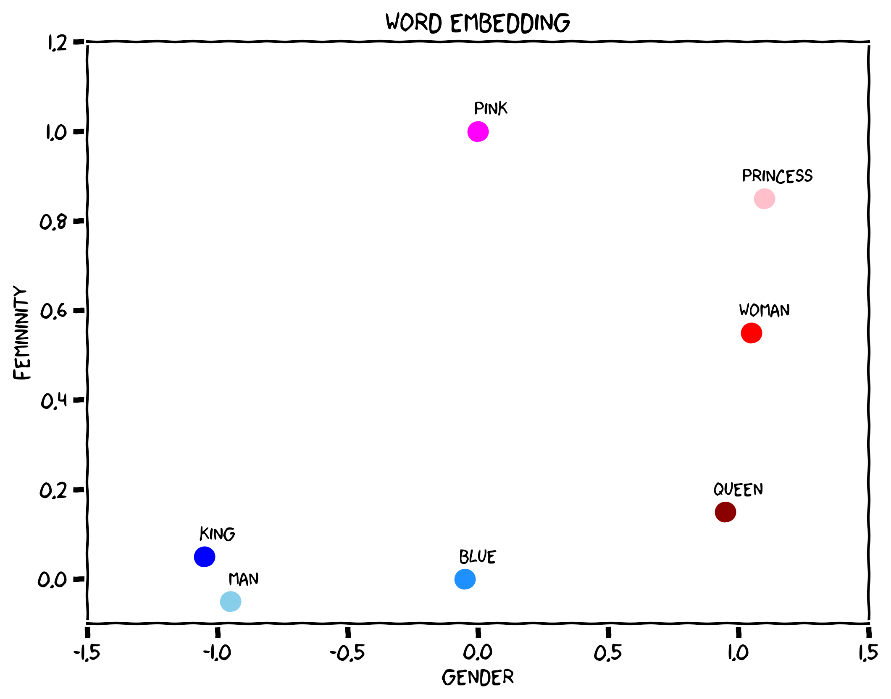
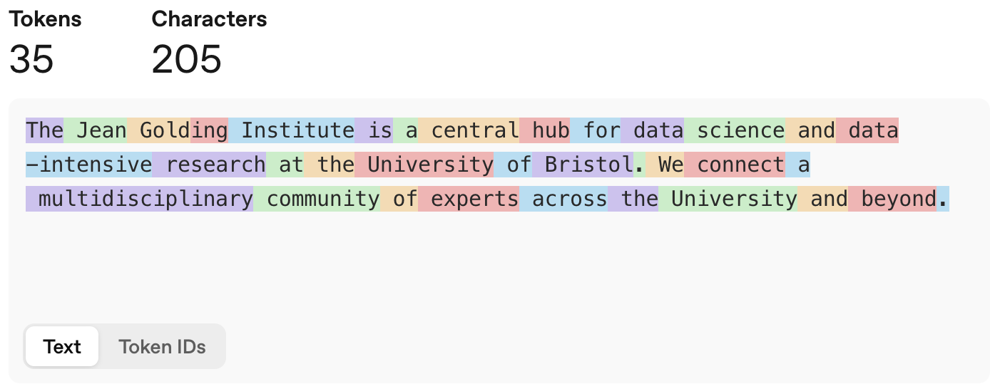
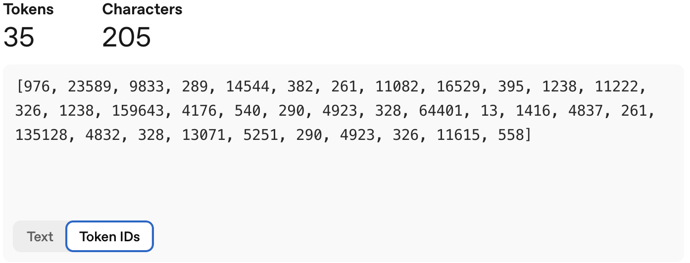
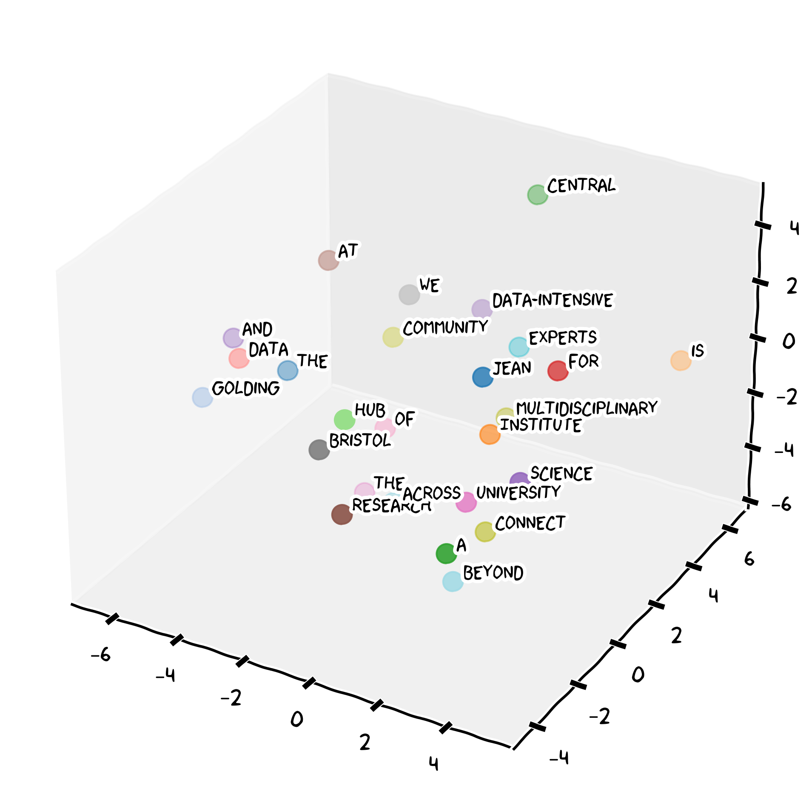

::: {.callout-note collapse="true"}
### Key Takeaways

- LLMs are mathematical models of language that maps similar words to nearby positions in a conceptual space
  - They predict which words are most likely to follow a given input, or prompt, based on patterns learned from vast amounts of text
  - They work by pattern matching, not true understanding, therefore they are not infallible sources of truth
- Always verify important information from authoritative sources
- Be aware of bias in AI outputs and actively check for it
- Use critical thinking - if something sounds too precise or extreme, investigate further
- Always follow University of Bristol AI guidance
:::

::: {.callout-caution icon="false"}
### 🦆 Warm-up activity with duck.ai {#warm-up-llms}

Before reading further, open [duck.ai](https://duck.ai) and try the following prompt:

> Complete this sentence in five different ways: "The culture was..."

What do you observe? This illustrates how LLMs rely on context and patterns to produce outputs, and why they can sometimes produce unexpected or incorrect results.
:::

### Natural Language Processing

Natural Language Processing (NLP) is a branch of Artificial Intelligence that serves as the foundational technology that enables Large Language Models to understand and generate human language. Natural language is inherently ambiguous and contextual.

Consider the sentence

::: {.center}
**"I saw the man with the telescope"**.
:::

This could mean:

- you used a telescope to see the man,
- or you saw a man carrying a telescope. 

At its core, NLP transforms words, phrases, and sentences into numerical representations called embeddings—high-dimensional vectors that capture semantic meaning and relationships between linguistic elements. These embedding spaces are constructed so that words or phrases with similar meanings are positioned closer together in the vector space, while semantically different concepts are farther apart. For example, "king" and "man" would be nearby vectors, as would "queen" and "woman" but "man" and "woman" would be distant. This mathematical representation of language allows to perform some complex reasoning about text by manipulating these vectors through neural network operations.

{width=90%}

### The Large Language Model Revolution

Large Language Models represented a paradigm shift in learning language patterns from the Internet, books, and other vast text sources. Built on [transformer architecture](https://en.wikipedia.org/wiki/Transformer_(deep_learning_architecture)), LLMs focus on relevant parts of the input when processing words (tokens) or phrases, enabling understanding of long-range dependencies that earlier models missed. While you don't need to understand the mathematics, the key insight is that LLMs work by finding patterns and relationships between concepts.

Let's assume that we want to embed the words of this sentence:

> The Jean Golding Institute is a central hub for data science and data-intensive research at the University of Bristol. We connect a multidisciplinary community of experts across the University and beyond.

Our *chatbot* will break the sentence in tokens of one or less words and assign each a numeric identifier, as depicted below.
A  rule of thumb is that one token generally corresponds to 4 characters of text for common English.

Each of these tokens will have a mapping in the embedding space of our LLM model. 

{width=80%}

What makes LLMs "large" is their training scale, the exposure to hundreds of billions of words from diverse sources allows them to internalize grammar, vocabulary, world knowledge, and reasoning patterns. The training process is elegantly simple: models learn by predicting the next word in sequences, adjusting internal parameters based on prediction errors. This forces development of sophisticated internal representations of language and knowledge.

LLMs fundamentally change how we approach NLP tasks. Instead of building specialized systems for each application, a single LLM can handle multiple tasks through different prompting strategies. The same model that excels at translation can also summarize documents, answer questions, or generate creative content without additional training.

The implications for research are profound. Tasks requiring specialized software and technical expertise become accessible through natural language interaction. Literature triage, drafting and summarisation, code for data analysis, and extraction of structured information from papers and protocols are now available through conversational interfaces.

### What can LLMs do?

In a bioscience research context, LLMs can help with:

- **Writing assistance**: Drafting sections of papers, theses, grant applications, and emails
- **Summarization**: Condensing long papers or sets of papers into key points  
- **Translation**: Converting between languages, and between technical and lay registers (e.g. plain-language summaries)
- **Question answering**: Explaining methods, concepts, or unfamiliar terminology
- **Code generation**: Writing and explaining analysis code (R, Python, Bash)
- **Creative tasks**: Brainstorming hypotheses, experimental designs, and figure ideas

::: {.callout-important}
### University of Bristol AI guidance

However, LLMs introduce new challenges. LLMs "reproduce bias and stereotyping, hallucinates, and makes mistakes" and require "discernment and the critical faculties of a human being to evaluate outputs."

**LLM Limitations**

- **Hallucinations**.
LLMs can generate plausible-sounding but entirely incorrect information.
- **Bias**.
LLMs reflect biases present in their training data.
- **Mistakes**.
LLMs can make subtle errors that are difficult to detect without domain expertise.

**Why These Limitations Matter?**

- **Professional Responsibility**. Errors in your research can have serious consequences.
- **Academic Integrity**. Using unverified AI-generated content violates scholarly standards.
- **Ethical Obligations**. Propagating bias can harm individuals and communities.
- **Legal Implications**. Incorrect information in professional contexts can create liability.

[Find more →](./800-resources.qmd)
:::

::: {.callout-tip}
## Good Practice Examples

AI should **enhance** your capabilities, not **replace** your thinking:

✅ **Research Assistant**: "Help me identify key themes across these abstracts I've collected for my review"  
✅ **Writing Coach**: "Suggest ways to improve clarity in this methods paragraph I wrote"  
✅ **Brainstorm Partner**: "What controls should I consider when designing this assay?"  
✅ **Editor**: "Check this draft discussion for logical flow and suggest improvements"  
:::

::: {.callout-important}
## Why hallucinations are dangerous
The problem is not that LLMs make mistakes — so do humans. The problem is that hallucinations often **sound exactly like correct answers**. The model's tone and formatting do not change when it is making something up. It may even cite a plausible-sounding paper that does not exist.

**The Fake Citation**

Open [duck.ai](https://duck.ai) and enter:

> Give me three academic references (author, year, journal, title) about the effects of urban green spaces on mental health

Read the references carefully, then verify them.

**The Invented Fact**

Open [duck.ai](https://duck.ai) and enter:

> Should we be eating less meat by 2030 to lower cancer risk?

Read the response carefully, then verify it.

:::

 
---

### Exercise 1: Identifying LLM Limitations

**Scenario**: Compare the output of three synthetic examples below. They use a climate-impact example to make the patterns easy to spot—identify potential issues in each:

- Which output seems most reliable and why?
- What red flags can you identify in each response?
- How would you verify the information before using it in your research?

**Prompt**:

> Write 2 sentences about how climate change is impacting Bristol

---

**Output A**: "Bristol experienced its wettest year on record in 2023, with rainfall 40% above average. The Severn Estuary's sea level has risen 15cm since 2000, directly threatening the city center."

---

**Output B**: "Climate change will cause Bristol's temperature to increase by exactly 3.2°C by 2050, making it uninhabitable for most residents. The city council has already approved plans to relocate the entire population to higher ground."

---

**Output C**: "Bristol faces increased flooding risks due to climate change. The city has implemented various adaptation measures, though specific impacts vary by neighborhood and depend on global emission scenarios."

::: {.callout-caution collapse="true" icon=false}
### Solution example

**Output A**: *"Bristol experienced its wettest year on record in 2023, with rainfall 40% above average. The Severn Estuary's sea level has risen 15cm since 2000, directly threatening the city center."*

Contains specific statistics that need verification. While plausible, the exact figures should be fact-checked against official sources.

⚠️ *Specific statistics require verification*: "Wettest year on record" and "40% above average" are precise claims that need fact-checking  
⚠️ *Sea level measurement*: The specific "15cm since 2000" figure should be verified against official sources  
⚠️ *Causal claim*: Direct threat to city center needs geographic verification  
✅ *Generally plausible*: The types of impacts described are consistent with climate science

---

**Output B**: *"Climate change will cause Bristol's temperature to increase by exactly 3.2°C by 2050, making it uninhabitable for most residents. The city council has already approved plans to relocate the entire population to higher ground."*

Contains obvious hallucinations - overly precise predictions and extreme claims about population relocation that aren't realistic.

🚫 *Unrealistic precision*: "Exactly 3.2°C" - climate models deal in ranges, not exact predictions  
🚫 *Extreme claims*: "Uninhabitable for most residents" is hyperbolic and unsupported  
🚫 *False information*: No evidence of city council relocation plans  
🚫 *Hallucination*: Appears to invent specific policy decisions  

---

**Output C**: *"Bristol faces increased flooding risks due to climate change. The city has implemented various adaptation measures, though specific impacts vary by neighborhood and depend on global emission scenarios."*

Most reliable approach - acknowledges uncertainty, speaks in general terms about known issues, doesn't make unsupported specific claims.

✅ *Appropriately general*: Makes broad, supportable statements  
✅ *Acknowledges uncertainty*: "Vary by neighborhood" and "depend on scenarios"  
✅ *Realistic scope*: Doesn't make unsupported specific claims  
✅ *Professional tone*: Appropriate for briefing document  

---

**Key Learning Points**:

1. Be suspicious of overly precise statistics without sources
2. Extreme or alarmist language often indicates hallucination
3. The most useful AI outputs acknowledge uncertainty appropriately
4. Always verify specific factual claims before using them in your research

:::
