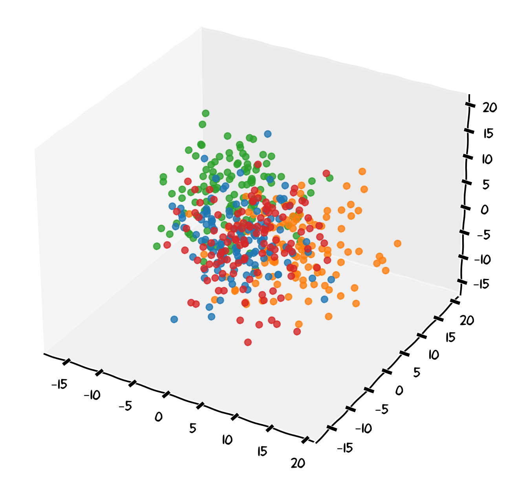

::: {.callout-note collapse="true"}
### Key Takeaways
- Context is all the information you give LLMs to understand your request (role, purpose, audience, requirements)
- Be specific, not vague - Clear context gets relevant responses; vague prompts get generic ones
- Refine iteratively - Start basic, review output, add details, repeat until satisfied
- Never share sensitive data - No personal records, unpublished research, or confidential information
:::

::: {.callout-caution icon="false"}
### 🦆 Warm-up activity with duck.ai {#warm-up-context}

Open [duck.ai](https://duck.ai) and send this minimal prompt:

> Write me a protocol for a Western blot

Then immediately send a follow-up prompt that adds context:

> I am a first-year PhD student in cell biology preparing a Western blot to detect phosphorylated ERK in mammalian cell lysates. Please write a clear, step-by-step protocol suitable for someone running this for the first time, noting common pitfalls and appropriate controls.

The first prompt will likely produce a very generic response—possibly a broad template that is almost useless. The second prompt, with clear context, should produce something targeted and practical. **Always treat any AI-generated protocol as a starting point to be checked against validated lab methods, never as a validated procedure.**
:::

Large Language Models work by navigating through vast embedding spaces—multidimensional representations of knowledge and concepts. Vague or poorly defined **context** can lead the model to explore irrelevant areas of this space, producing generic or off-target responses. Well-crafted context act as precise navigation instructions, guiding the model to the most relevant knowledge areas and ensuring outputs that match your specific needs and context.

{width=80%}

### Why Context Matters for LLMs

Context is everything you provide to an LLM to help it understand your request and generate appropriate responses during your chatbot session. Without proper context, LLMs often produce generic, inaccurate, or inappropriate outputs.

Because LLMs have **no memory** between separate sessions, they have no inherent knowledge about who you are, your research group's policies or the purpose of your request.

Example of poor context

> Write me a report about reproducibility

Example of better context

> I am a postgraduate researcher at the University of Bristol in the School of Biological Sciences. I have to write a 2-page summary about the reproducibility of high-throughput sequencing pipelines for my supervisor, focusing on evidence-based practices and including practical implementation steps.

Note that while LLMs have no memory between separate chat sessions and don't retain information from previous conversations, the data you share within each individual session may still be stored by the service provider. Always follow University's data protection policies when sharing any information.

::: {.callout-important}
## University of Bristol guidance

When writing your context, never share these with AI tools:

🚫 **Personal data**: Participant records, staff information, health data  
🚫 **Confidential research**: Unpublished findings, sequences or datasets, grant applications under review  
🚫 **Commercial sensitive**: Partnership agreements, financial information, IP under patent  
🚫 **Legal privileged**: Legal advice, disciplinary proceedings  
🚫 **Security sensitive**: Passwords, system configurations, access credentials

[Find more →](./800-resources.qmd)
:::

### Types of Context

**Explicit Context**. 
Information you directly provide to the LLM, for example:  

- Your role and research area
- The purpose of the task
- Target audience

**Implicit Context**. 
Assumptions the LLM makes based on your prompt, for example:

- Cultural assumptions
- Educational level expectations  
- Language formality

::: {.callout-tip}
## Making Implicit Context Explicit
Instead of assuming the LLM will understand your context, state it clearly:

**Instead of**

> Help me write a proposal on sustainable materials

**Try**

> I'm a postgraduate researcher at the University of Bristol in biosciences. Help me write a 3-page research funding proposal, targeting the BBSRC, for a project on engineering microbial communities for sustainable biomanufacturing
:::

### Working Within Context Limits

LLMs have **context windows**, limits on how much text they can process at once or over different iterations. Some practical strategies to overcome this limitation are:

- Summarize lengthy background information and prioritize the most important context
- Break complex tasks into smaller parts
- Use previous outputs as context for follow-up requests

### Iterative Context Building

We will not always get what we want at the first attempt. A useful strategy is starting with basic context and refine:

1. **Initial request**: Provide core context
2. **Review output**: Identify what's missing or wrong
3. **Refine context**: Add specific details or corrections
4. **Iterate**: Repeat until satisfactory

 
---

### Exercise 2: Context Writing

Transform a vague prompt into an effective, contextualised request. Use [duck.ai](https://duck.ai) to observe the difference that context has on your request.

**Scenario**: You need to write a short data management plan section for a project involving human participant samples in your research group.

**Initial prompt:**

> Write a 1-page-long data management plan

::: {.callout-caution collapse="true" icon=false}
### Solution example

#### Initial prompt

> Write a 1-page-long data management plan

This will produce a generic template, not tailored to biosciences, your data types, or institutional requirements.

#### Contextualised prompt

> **Context**. I am a PhD researcher in the School of Biological Sciences at the University of Bristol, working on a project that generates RNA-seq data from anonymised human tissue samples obtained under an existing ethics approval.  
> **Purpose**. Create a clear data management plan section that covers data collection, storage, anonymisation, sharing, and long-term archiving, *complying with University data protection policy, UK GDPR, and funder (BBSRC/MRC) requirements*.  
> **Audience**. My supervisor and the funder's review panel.  
> **Scope**. Cover raw and processed sequencing data and associated metadata. Exclude consent procedures (covered in the ethics application) and lab safety (covered separately).  
> **Format**. 1 page with clear headings, bullet points for procedures, and reference to controlled-access repositories where relevant.

Compare the two outputs. Note how much more useful the contextualised version is—while remembering that you must still verify any specific claims about policy or repository requirements against authoritative University and funder sources.

:::
